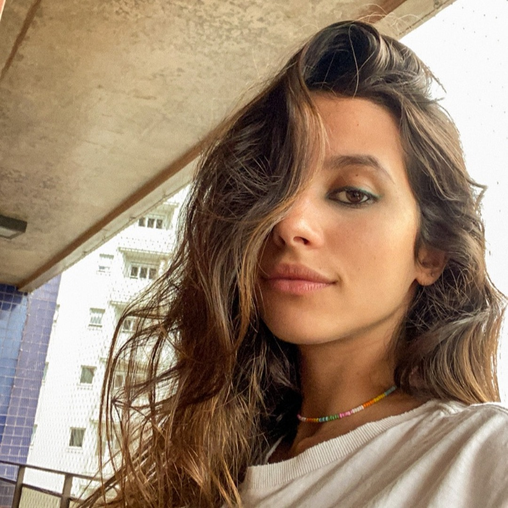

# Atividade Ponderada 1 - Semana 03

Durante a semana 03 do décimo módulo de Engenharia da Computação recebemos o nosso primeiro desafio: uma ponderada envolvendo desenvolvimento mobile, especificamente o desenvolvimento para Android em Kotlin.  
O desafio era simples, tínhamos uma lista de coisas para verificarmos e no final deveríamos ter um app de dado 100% funcional. Esse dado deveria ter 4 diferentes versões: D6, D10, D20, D100, todas com a mesma premissa, mas com resultados que ficavam cada vez maiores.

# Responsáveis por essa atividade

<table>
  <tr>
    <td align="center" width="260">
        
      <strong>Fernando Soares de Oliveira</strong> 
      Código, documentação e explicação  
      <a href="https://www.linkedin.com/in/fernando-soares-de-oliveira/">LinkedIn</a>
    </td>
    <td align="center" width="260">
        
      <strong>Pietra Batista</strong> 
      Código, anotações e ideias de resolução  
      <a href="https://www.linkedin.com/in/pietrabatista/">LinkedIn</a>
    </td>
    <td align="center" width="260">
        
      <strong>Roberto Branco Diniz Filho</strong> 
      Código, sintaxe de Kotlin e ideias de resolução  
      <a href="https://www.linkedin.com/in/roberto-dbf/">LinkedIn</a>
    </td>
  </tr>
</table>

# Qual o racional da equipe?

Talvez você esteja se perguntando quais foram os nossos passos para chegarmos até a resolução do desafio proposto. Nós imaginamos que você teria essa dúvida (É, Murilão, a gente sabia!) então desde o primeiro momento anotamos cada uma das etapas que seguíamos e você pode conferir a nossa elaboração aqui:

Começamos pela parte em que quase todo dev esquece, quebrando o problema em pequenas tarefas:

TASK:

1. executar o app
2. identificar qual o erro
3. identificar o erro no código
4. corrigir no código
5. expandir pra d10
6. expandir pra d20
7. expandir pra d100
8. implementar uma funcionalidade onde o usuário consiga escolher o tipo da dado e pressione um botão

---

CONCLUSÃO:

- os dados geram valores de acordo com a realidade
- a interface permite escolha de dado
- o fluxo deve ser coerente
- colocar faces diferentes

-----

DIARIO DE DESENVOLVIMENTO:

- quando fomos rodar o repo deu o warning de que o gradle estava dando erro, algo que ocorreu na aula anterior e a prof Fabi deu uma orientação para nós. então começamos um projeto vazio e colamos somente as pastas fundamentais para o desenvolvimento da atividade. Colamos a pasta `/app` (usada pelo professor para o desenvolvimento do app) e o arquivo `local.properties`
- instalamos o pixel 6a para conseguirmos entender o erro na prática
- esperamos instalar e em seguida rodamos pela primeira vez o app
- ao rodar pela primeira vez, tudo parecia muito certo para nós, mas desde quando um dado D6 tem 0 e não tem 6? Problema identificado!
- identificamos o problema na linha 67
- o problema não é o tanto de números que são gerados (que são exatamente 6), o problema são os números exibidos. Com isso, podemos simplesmente adicionar um
- com `Command + F` procuramos por `D6`, para identificar onde visualmente criamos o botão de `D6`
- identificamos e criamos todos os botões para os dados necessários
- identificamos como replicar o processo do `D6` com os demais dados e criamos o mesmo processo para todos
- pedimos auxílio para a IA para entender como colocar imagens dentro do projeto. o objetivo é mostrar imagens correspondentes à face do dado que tiramos
- conclusão: precisamos colocar a imagem dentro `app/src/main/res/drawable`
- fizemos os imports necessários

Essa é a versão crua, exatamente como anotamos em nosso bloco de notas, mas nos sentiríamos muito culpados caso não colocássemos uma versão mais organizada, então aqui vai (essa nova versão é a mesma coisa do acima, mas feita com auxílio de Inteligência Artificial):

## Diário de Desenvolvimento

Ao tentar executar o repositório pela primeira vez, encontramos um aviso relacionado ao Gradle, problema semelhante ao que havia ocorrido na aula anterior. Como a professora Fabi já havia orientado sobre esse tipo de situação, decidimos criar um projeto vazio e copiar apenas os arquivos fundamentais para o desenvolvimento da atividade.

Foram copiados a pasta `/app`, utilizada no projeto original do professor, e o arquivo `local.properties`. Depois disso, instalamos o emulador Pixel 6a para conseguir executar o aplicativo e analisar o erro na prática.

Após a instalação, rodamos o aplicativo pela primeira vez. Inicialmente, tudo parecia funcionar corretamente, mas logo percebemos um comportamento incorreto: um dado D6 estava gerando o valor 0 e não estava gerando o valor 6. A partir disso, identificamos o problema principal da aplicação.

O erro foi localizado na linha 67. O problema não estava na quantidade de números gerados, pois eram exatamente seis possibilidades. O problema estava nos valores exibidos, já que o sorteio começava em 0 em vez de começar em 1. Dessa forma, a correção consistiu em ajustar o cálculo para que os resultados fossem exibidos de 1 até o número máximo do dado selecionado.

Em seguida, utilizamos o atalho `Command + F` para procurar por `"D6"` no código e identificar onde o botão do dado era criado visualmente. A partir desse ponto, replicamos a lógica existente para criar os botões dos demais dados necessários: D10, D20 e D100.

Depois disso, analisamos como reaproveitar o processo do D6 para os outros tipos de dado. Com base nessa lógica, criamos o mesmo fluxo para todos os dados, garantindo que cada botão alterasse corretamente o tipo de dado selecionado e que o lançamento respeitasse o limite de cada um.

Também pedimos auxílio à IA para entender como inserir imagens dentro do projeto Android. O objetivo era exibir imagens correspondentes ao resultado obtido no lançamento do dado, representando visualmente a face sorteada.

Com isso, entendemos que as imagens devem ser adicionadas dentro do diretório:

`app/src/main/res/drawable`

Após adicionar os arquivos necessários, fizemos os imports correspondentes no código e iniciamos a implementação da exibição das imagens de acordo com o resultado gerado.

# Quais foram as dificuldades do trabalho?

Nossas maiores dificuldades moraram no desafio para ir além. As imagens foram um problema para nós, mas que foi facilmente resolvido. Gostaríamos muito de ter ido até o D100 acompanhando com imagens os resultados, mas a nossa abordagem faria com que isso demorasse muito, além do tempo disponibilizado em sala.  
Embora essa tenha sido uma dificuldade, a identificação do problema (em tese o maior desafio) foi "fácil" e muito divertida.

# Contribuições de cada membro

| Integrante | Foto | Contribuições |
|---|---|---|
| **Fernando Soares de Oliveira** |  | Código, documentação e explicação |
| **Pietra Batista** |  | Código, anotações durante o desenvolvimento e ideias de resolução |
| **Roberto Branco Diniz Filho** |  | Código, sintaxe de Kotlin e ideias de resolução |
